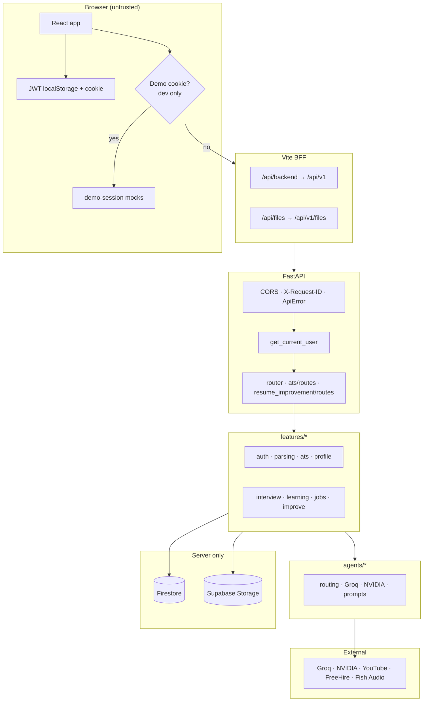
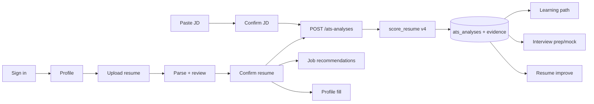
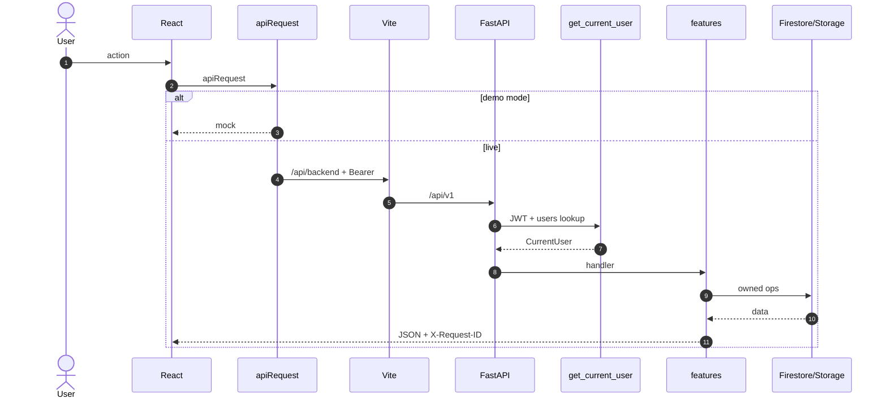
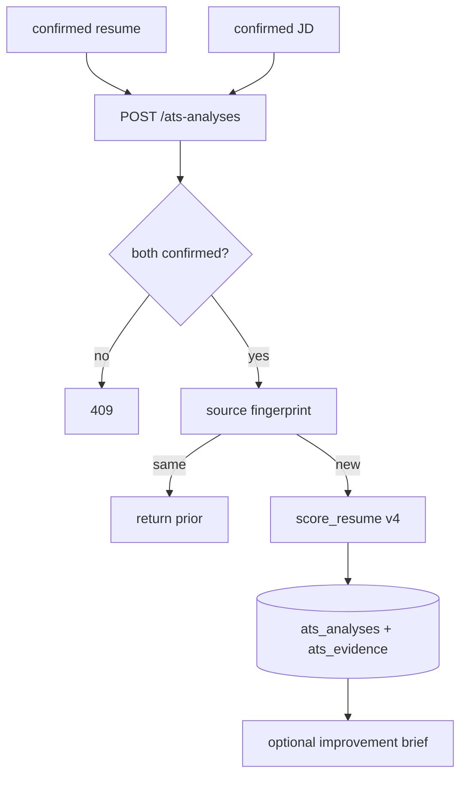
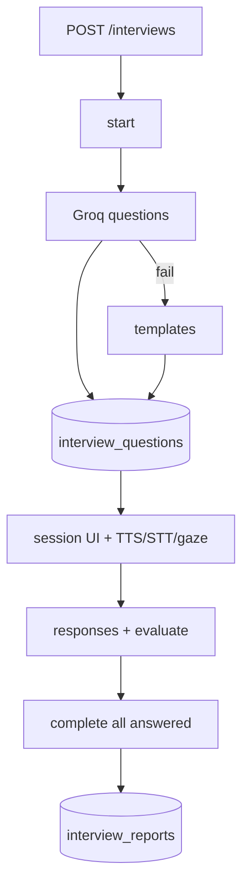
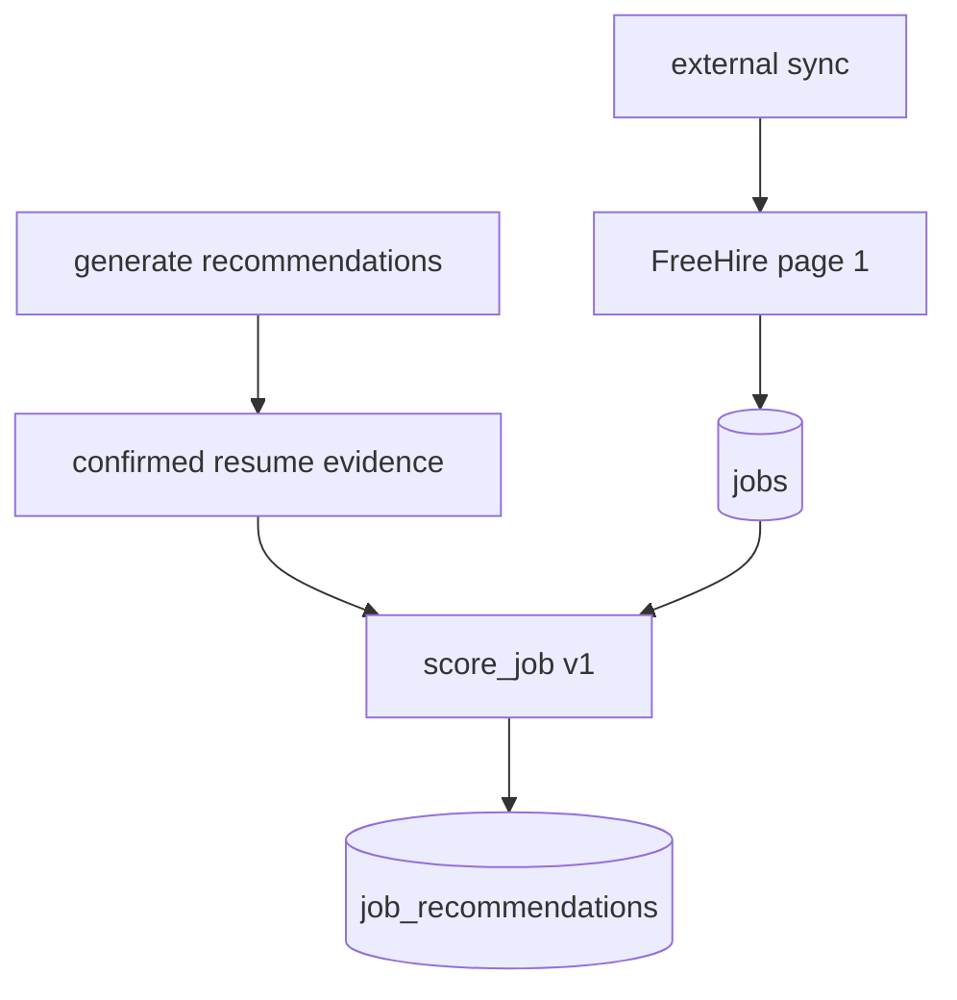
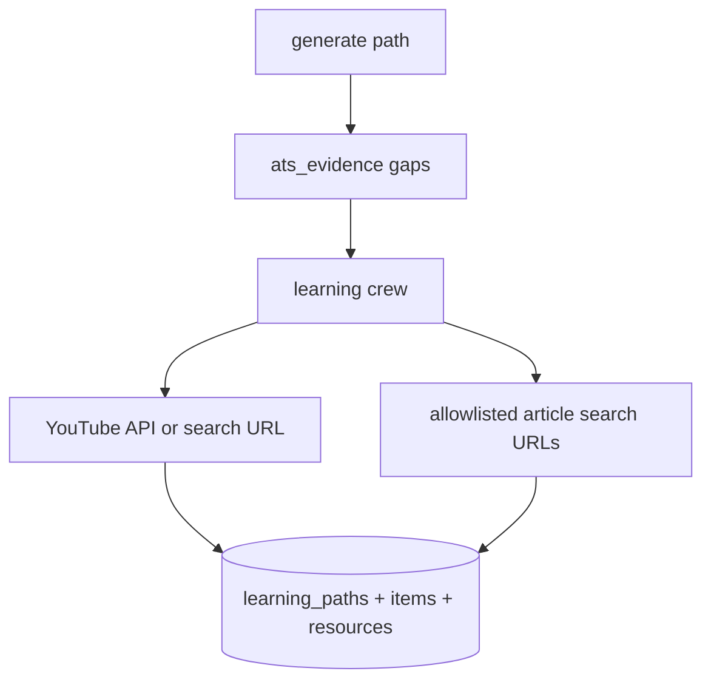
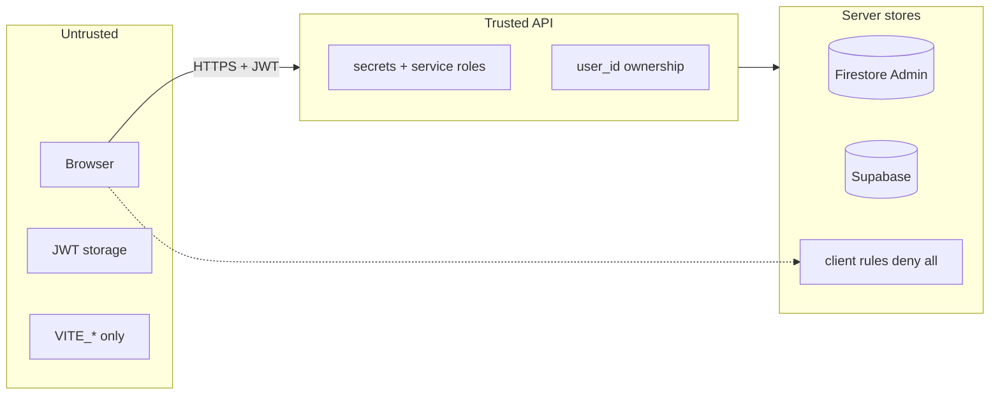

# Career Copilot — Unified Technical Documentation

**Version:** 1.0.0  
**Last updated:** 2026-08-08  
**Source of truth:** this file (generated from the repository)  
**Scope:** product purpose, architecture, how every subsystem works, data model, APIs, agents, code map, frontend, operations, and diagrams

> **Golden rule:** Do not invent the candidate’s career. Only text the user types, uploads, **confirms**, or explicitly accepts is used for ATS, learning gaps, interview evidence, and job matching. LLM / YouTube / storage service keys stay on the server. The browser never talks to Firestore directly.

---

## Table of contents

1. [Aim and problem statement](#1-aim-and-problem-statement)
2. [What the product does (and does not)](#2-what-the-product-does-and-does-not)
3. [Tech stack](#3-tech-stack)
4. [Models, frameworks, and libraries](#4-models-frameworks-and-libraries)
5. [Project architecture](#5-project-architecture)
6. [How the project works (end-to-end)](#6-how-the-project-works-end-to-end)
7. [How each feature works](#7-how-each-feature-works)
8. [Agents and LLM providers](#8-agents-and-llm-providers)
9. [Data model](#9-data-model-firestore--supabase-storage)
10. [API surface](#10-api-surface)
11. [Code map](#11-code-map--application-layout)
12. [Frontend architecture](#12-frontend-architecture)
13. [Configuration](#13-configuration-and-environment)
14. [Operations and testing](#14-operations-scripts-and-testing)
15. [Mermaid diagrams](#15-mermaid-diagrams)
16. [Design principles](#16-design-principles-and-non-goals)
17. [Known contracts and caveats](#17-known-contracts-and-caveats)

---

## 1. Aim and problem statement

### Aim

Career Copilot is a **private career workspace for one candidate at a time**. It helps a job seeker:

1. Build a structured profile and upload a resume (PDF/DOCX).
2. Review extracted text/sections, then **confirm** them (confirm gate).
3. Score the resume against a confirmed job description with **exact keyword evidence**.
4. Practice mock interviews (optional browser voice Q&A + optional Fish Audio TTS) with practice feedback.
5. Generate free learning paths from ATS gaps (YouTube API / search URLs + allowlisted article search URLs — no invented IDs).
6. Browse job recommendations grounded in **confirmed resume evidence**.

### Problem statement

| Problem                                         | Product response                                                                         |
| ----------------------------------------------- | ---------------------------------------------------------------------------------------- |
| ATS scores with no proof                        | Deterministic keyword coverage + exact resume quotes (`evidence-keyword-coverage-v4`)    |
| OCR/LLM extraction errors feed scoring silently | **Confirm gate** — only `confirmed` resume/JD text powers ATS, learning, prep, job match |
| Invented YouTube videos / fake IDs              | YouTube Data API or search-page URLs only; articles are allowlisted search URLs          |
| Client-side DB access bypasses ownership        | FastAPI + Admin SDK only; Firestore rules deny all client access                         |
| Secrets in the browser                          | Only `VITE_*` keys reach the frontend                                                    |
| Over-promising “hireability AI”                 | No hiring-decision scores; interview feedback is **practice coaching**                   |

---

## 2. What the product does (and does not)

### Features (included)

| Area                   | What you get                                                                                                                  |
| ---------------------- | ----------------------------------------------------------------------------------------------------------------------------- |
| **Auth**               | Supabase email/password + app JWT; Firebase Google exchange to app JWT; legacy Firebase/local email fallback during migration |
| **Profile**            | Structured fields, avatar, completion 0–100, fill-from-resume preview → apply                                                 |
| **Resume / JD**        | Upload or paste → review → **confirm**                                                                                        |
| **ATS**                | Deterministic keyword coverage (`evidence-keyword-coverage-v4`); history shows resume + JD used                               |
| **Interviews**         | Question packs, practice sessions, optional Fish Audio TTS / browser STT, gaze metrics, practice evaluation                   |
| **Learning**           | ATS gaps → YouTube + allowlisted educational search URLs (`ats-mixed-learning-v1`)                                            |
| **Jobs**               | Evidence-based recommendations; FreeHire sync; saved/pipeline tracking                                                        |
| **Resume improvement** | Evidence-checked rewrite suggestions via sequential crew                                                                      |
| **Account wipe**       | Confirm with phrase `DELETE MY ACCOUNT`                                                                                       |
| **Theme**              | Light / dark / system preference                                                                                              |

### Not included (by design)

- Invented skills, employers, metrics, or YouTube video IDs
- AI hiring decisions or “you will get the job” prediction scores
- Product-path embedding / cosine-similarity ATS
- Direct browser access to Firestore or storage service keys
- Multi-tenant recruiter portal
- Background Celery workers (all product paths are request/response synchronous; long work runs in-process with timeouts)

---

## 3. Tech stack

| Layer              | Technology                                                   | Role                                             |
| ------------------ | ------------------------------------------------------------ | ------------------------------------------------ |
| **Frontend**       | Vite 8, React 19, TypeScript, React Router 7, Tailwind CSS 4 | SPA UI                                           |
| **UI**             | Base UI, Lucide, Motion, CVA                                 | Components / icons / motion                      |
| **3D / globe**     | Three.js, R3F/Drei, Cobe                                     | Jobs globe                                       |
| **Auth client**    | Supabase Web SDK + Firebase Web SDK                          | Email/password via Supabase; Google via Firebase |
| **Backend**        | FastAPI, Uvicorn, Pydantic v2                                | HTTP API                                         |
| **Auth server**    | PyJWT (HS256), scrypt                                        | App JWT + password hashes                        |
| **Database**       | Cloud Firestore (`firebase-admin`)                           | Structured candidate data                        |
| **Object storage** | Supabase Storage (service role HTTP)                         | Resumes, avatars, exports                        |
| **Documents**      | pypdf, python-docx; optional pymupdf, pdfplumber             | Text extract                                     |
| **PDF export**     | reportlab                                                    | Resume export                                    |
| **HTTP**           | httpx                                                        | LLMs, YouTube, FreeHire, Supabase, Fish Audio    |
| **LLM**            | Groq preferred, NVIDIA fallback                              | Chat completions                                 |
| **Crews**          | Optional `crewai`; else built-in sequential orchestrators    | Learning + resume improve                        |
| **TTS**            | Groq Orpheus (via `GROQ_API_KEY`)                            | Interviewer voice                                |

### Runtime

| Runtime | Constraint                      |
| ------- | ------------------------------- |
| Node.js | 20+                             |
| Python  | 3.11–3.13 (repo pin often 3.12) |

### Monorepo layout

```text
career-copilot/
├── frontend/          # Vite + React SPA
├── backend/           # FastAPI package career-copilot-api
├── docs/              # Documentation (this file is canonical)
├── firebase/          # Deny-all client rules
├── scripts/           # setup, dev, diagnostics
├── secrets/           # local service-account JSON (gitignored)
├── package.json       # root scripts
└── .env / .env.example
```

---

## 4. Models, frameworks, and libraries

### Algorithm versions (product)

| Algorithm        | Constant                       | File                                                |
| ---------------- | ------------------------------ | --------------------------------------------------- |
| ATS scoring      | `evidence-keyword-coverage-v4` | `backend/app/features/ats/ats_score.py`             |
| Job match        | `evidence-keyword-match-v1`    | `backend/app/features/career_matching.py`           |
| Learning path    | `ats-mixed-learning-v1`        | `backend/app/features/learning/youtube_catalog.py`  |
| Interview report | `evidence-report-v2`           | `backend/app/features/interview/agent/evaluator.py` |

### LLM models (env-configured)

| Provider               | Env keys                    | Typical use                                                      |
| ---------------------- | --------------------------- | ---------------------------------------------------------------- |
| **Groq**               | `GROQ_*`                    | Interviews, briefs, learning planner, many agents when preferred |
| **Groq resume parser** | `GROQ_RESUME_PARSER_*`      | Optional section segregation model                               |
| **NVIDIA**             | `NVIDIA_*`                  | Fallback / when preferred                                        |
| Preference             | `LLM_PROVIDER=groq\|nvidia` | Primary first, then the other if configured                      |

**Product ATS score uses no LLM.** Interview questions prefer Groq; templates on failure/unconfigured.

### Prompt packs (`backend/app/agents/prompts/`)

| File                              | Used by                             |
| --------------------------------- | ----------------------------------- |
| `improve_resume_v1.txt`           | Resume improvement                  |
| `fill_profile_from_resume_v1.txt` | Profile fill                        |
| `interview_questions_v1.txt`      | Mock interview start                |
| `interview_preparation_v1.txt`    | Interview preparation               |
| `interview_answer_eval_v1.txt`    | Per-answer practice evaluation      |
| `interview_session_report_v1.txt` | Session completion report           |
| `ats_improvement_v1.txt`          | ATS improvement brief               |
| `learning_youtube_path_v1.txt`    | Learning planner                    |
| `document_section_extract_v1.txt` | Section segregation (when LLM used) |
| `repair_structured_output_v1.txt` | JSON repair pass                    |

---

## 5. Project architecture

### Layered backend

```text
backend/app/
├── main.py                 # ASGI: CORS, request ID, exception handlers, routers
├── core/                   # settings, constants, ApiError
├── api/                    # HTTP surface (router, schemas, auth router)
├── database/               # Firestore + Supabase Storage adapters, ownership helpers
├── agents/                 # provider clients, prompts, registry, preferred routing
└── features/               # domain modules
```

### Trust boundaries

| Boundary        | Rule                                                             |
| --------------- | ---------------------------------------------------------------- |
| Browser         | Untrusted; never holds service keys                              |
| Vite BFF        | Dev/preview proxy only; not a second auth system                 |
| FastAPI         | Authenticates JWT; owns multi-tenant isolation                   |
| Firestore rules | Deny all client SDK access                                       |
| Storage         | Private Supabase bucket; bytes only via authenticated file route |

### Local request path

```text
Browser (Vite + React)
  Authorization: Bearer <JWT>  (+ cookie career_copilot_session for )
        │
        ├─ /api/backend/*  ──Vite proxy──►  FastAPI /api/v1/*
        └─ /api/files/*    ──Vite proxy──►  FastAPI /api/v1/files/*
                │
                ▼
           FastAPI (ownership enforced)
                ├─ Firestore      (rows)
                ├─ Supabase Storage (files under {user_id}/…)
                └─ Groq / NVIDIA / YouTube / FreeHire / Fish Audio  (server .env)
```

**Important file URL contract:** signed URLs are stored as relative `/api/files/{bucket}/{path}`. The Vite (or production reverse proxy) must rewrite that path to `/api/v1/files/...`. Direct hits on FastAPI without the rewrite return 404.

---

## 6. How the project works (end-to-end)

### 6.1 Boot

1. Root `npm run dev` → `scripts/dev/preflight.mjs` (env/Firestore checks) → spawns frontend + backend.
2. Backend: `uvicorn app.main:app` loads `Settings` from root `.env`.
3. Frontend: Vite on `127.0.0.1:3000` proxies API to `PUBLIC_API_BASE_URL` (default `http://127.0.0.1:8000`).

There is **no** separate Celery/worker process in the product path. Work runs inside the API request (with timeouts, RPM limiting, and graceful deterministic fallbacks).

### 6.2 Authenticated API call

```text
UI → shared/api/client.ts :: apiRequest
  → if demo cookie (non-production only) → demo-session mocks (no network)
  → else Bearer JWT + credentials: include
  → /api/backend/... → Vite rewrite → /api/v1/...
  → get_current_user (JWT decode + users row lookup in a worker thread)
  → handler → features/* → database/client (owned rows / storage)
  → JSON + X-Request-ID
```

GET requests without AbortSignal are de-duplicated in-flight per `method:path:token`.

### 6.3 Confirm gate (central product rule)

```text
upload/parse → extraction_status = review_required
             → user PATCH extraction (optional)
             → POST confirm → extraction_status = confirmed (+ candidate_confirmed_at)
```

**Only confirmed** resume versions and job descriptions may enter:

- ATS scoring
- Learning path generation (via completed ATS evidence)
- Interview preparation evidence
- Job-match evidence (confirmed resume text)

Profile fill may use any version with extractable text (its own preview/apply gate), but ATS/interview still require confirmation separately.

### 6.4 Primary candidate journey

1. **Sign up / sign in** → app JWT stored in `localStorage` + cookie
2. **Onboarding / profile** (optional fill-from-resume)
3. **Upload resume** → deterministic parse → review → **confirm**
4. **Paste/upload JD** → review → **confirm**
5. **ATS analysis** → evidence rows + optional LLM brief
6. Optional: learning path, mock interview, job recommendations, resume improvement
7. Iterate by re-uploading a revised resume

### 6.5 Provider routing

`backend/app/agents/providers/routing.py`:

1. `preferred_llm_provider` reads `LLM_PROVIDER` (`groq` | `nvidia`).
2. `preferred_llm_providers` returns configured providers in preference order.
3. Agents try preferred first, then the other, then deterministic behavior where defined.

### 6.6 Data access patterns

| Pattern     | Behavior                                                                                                  |
| ----------- | --------------------------------------------------------------------------------------------------------- |
| Ownership   | Nearly all queries filter `user_id` via `owned_row` / `owned_rows`                                        |
| Recency     | In-process `sort_rows_by_recency` — Firestore `order_by(created_at)` drops docs missing the field         |
| Soft delete | Resumes set `deleted_at`; live lists use `is_("deleted_at", "null")` (client-side null-or-missing filter) |
| Counts      | `count="exact", head=True` materializes matching docs and counts them                                     |
| Storage     | Logical prefixes `DOCUMENT_BUCKET` / `AVATAR_BUCKET` inside one Supabase bucket                           |
| Activity    | Written best-effort; pruned to a max event count                                                          |

### 6.7 Bootstrap

`GET /me/bootstrap` fans out parallel Firestore reads (profile, active resume, confirmed resume count, latest JD/ATS, activity, interview progress, counts) and returns:

- Profile + avatar URL
- Workspace readiness flags (`has_active_resume`, `has_confirmed_resume`, `ready_for_ats`, …)
- Capability flags (which AI features are configured)
- Agent status inventory

Bootstrap is **read-only** (no completion recalculation or cleanup writes).

---

## 7. How each feature works

### 7.1 Auth

**Password path (backend):**

1. Sign-up: validate email/password → scrypt hash → create `users` + `profiles` + preference rows (rollback on partial failure).
2. Sign-in: verify scrypt → issue app JWT.
3. Password update: require current password when a hash exists; Firebase-only accounts (empty hash) may set a first password.

**Firebase path (frontend primary for email + Google):**

1. Firebase Web SDK signs in (email/password or Google popup/redirect).
2. Client obtains Firebase ID token.
3. `POST /auth/firebase` verifies with Admin SDK (`check_revoked` configurable).
4. Server upserts user by verified email + `firebase_uid` (refuses silent link onto existing password accounts).
5. Issues **app JWT** — all product APIs use the app JWT, not long-lived Firebase tokens.

**Frontend compatibility:** if Firebase email sign-in fails with user-not-found / invalid-credential, the client falls back to `POST /auth/sign-in` for legacy backend-only accounts.

**Session storage:**

| Location     | Key                                                                                  |
| ------------ | ------------------------------------------------------------------------------------ |
| localStorage | `career_copilot_access_token`                                                        |
| Cookie       | `career_copilot_session` (SameSite=Lax; used for authenticated file GETs in ``) |

**Account deletion:** phrase `DELETE MY ACCOUNT` + email match → collect storage paths → purge objects → delete user-owned collections → profile → user.

### 7.2 Document parsing

**Entry:** `parse_document_bytes` (`features/document_parsing/pipeline.py`).

1. **Validate** mime/size (`validate_document`).
2. **Extract text** off the event loop (`asyncio.to_thread` → `text_extract.py`): optional PyMuPDF/pdfplumber, then pypdf; DOCX via python-docx.
3. **Sections:** upload path uses `prefer_llm=False` so review never blocks on a remote model. Structural layout parser (`llm_sections.extract_sections_structural` / sections heuristics). LLM segregation is available when explicitly preferred for AI-powered flows.
4. **Clean structured content:** strip empty lines, preserve URLs into a `links` section.
5. Persist `extraction_status=review_required`, warnings, plain text.

User flow: PATCH extraction → POST confirm → `confirmed`.

### 7.3 Profile

- **Completion:** weighted checklist 0–100 (`completion.py`); recalculated after mutations.
- **Child resources:** skills, experiences, projects, education, certifications, languages, links via `/profile/{resource}`.
- **Avatar:** upload to `AVATAR_BUCKET/{user_id}/avatars/...`; profile stores path; browser uses signed `/api/files/...` URL.
- **Fill-from-resume:**
  1. Load version (preferred confirmed, or any with text).
  2. AI extract (preferred LLM) + deterministic mapping.
  3. Evidence filter (must ground in resume text — imperfect; see caveats).
  4. **Preview** returns draft; **apply** writes only selected rows.
- **Skills import:** deterministic skill candidates from confirmed resume text.

### 7.4 ATS scoring (product path)

| Item      | Value                          |
| --------- | ------------------------------ |
| Scorer    | `features/ats/ats_score.py`    |
| Version   | `evidence-keyword-coverage-v4` |
| Persist   | `POST /api/v1/ats-analyses`    |
| Stateless | `POST /api/v1/ats/score`       |

**How scoring works:**

1. Require confirmed resume version + confirmed JD.
2. Fingerprint source texts + confirm timestamps; if an identical completed analysis exists, return it.
3. Extract JD requirement terms (required vs preferred weights; section markers; alias groups for JS/TS/k8s/…).
4. Match against resume plain text + structured sections.
5. Match strengths: strong (1.0), partial (0.5), missing (0.0) → weighted overall 0–100.
6. Persist `ats_analyses` + one `ats_evidence` row per term (exact resume quote or null).
7. Optional improvement brief (preferred LLM, deterministic fallback) attached to summary — never invents experience.

**Not the product path:** `features/ats/agent/*` and `features/ats/scoring/*` composite/crew libraries for tests/experiments. Product persist always uses deterministic `score_resume`.

### 7.5 Resume improvement

**Route module:** `features/resume_improvement/routes.py`.

Sequential crew (`agents/crew/orchestrator.py`):

1. **Gap analyst** — missing keywords from ATS evidence only.
2. **Resume improver** — preferred LLM generates rewrite suggestions for selected blocks.
3. **Evidence validator** — drops suggestions that fail server-side grounding checks.

Suggestions can be accepted/rejected/edited; apply creates a new resume version. Export PDF/DOCX via reportlab/docx. Primary product loop remains: edit locally → re-upload → re-confirm → re-score.

### 7.6 Mock interview

```text
POST /interviews
  → POST /interviews/{id}/start   (generate questions)
  → POST /interviews/{id}/responses  (answer + optional evaluation)
  → POST /interviews/{id}/complete   (requires all questions answered)
  → GET  /interviews/{id}/report
```

| Piece       | How it works                                                                                       |
| ----------- | -------------------------------------------------------------------------------------------------- |
| Questions   | Groq structured JSON, else local templates (`question_generator.py`)                               |
| Preparation | Evidence packs from confirmed resume + JD (`preparation.py`)                                       |
| TTS         | Groq Orpheus, then NVIDIA Magpie, then Fish (`POST /interviews/tts`); browser speechSynthesis last |
| STT         | Browser Web Speech API (Chromium / secure context)                                                 |
| Gaze        | Client-side metrics; server normalizes without inventing camera data                               |
| Evaluation  | Practice feedback (score, strengths, improvements, fillers, pace) — coaching only                  |
| Complete    | Rejects with 409 if unanswered questions remain                                                    |

### 7.7 Learning paths

Algorithm `ats-mixed-learning-v1`:

1. Require a completed ATS analysis.
2. Extract gaps from evidence (`not_found` / `partial_match`).
3. Crew plans search queries (model never invents video IDs).
4. Materialize:
   - YouTube Data API → real `watch?v=` IDs, or
   - YouTube search-page URLs only, plus
   - Allowlisted educational **search** URLs (MDN, docs sites, freeCodeCamp search, etc.) — no invented article paths.
5. Persist `learning_paths` + `learning_items` + `learning_resources`.
6. Item progress updates path `progress_percentage`.

### 7.8 Jobs and recommendations

| Endpoint                             | Behavior                                                                               |
| ------------------------------------ | -------------------------------------------------------------------------------------- |
| `GET /jobs`                          | Active jobs catalog (newest published first, client-side order)                        |
| `POST /jobs/external/sync`           | FreeHire page 1 search from candidate preferences; cooldown + process lock             |
| `POST /job-recommendations/generate` | Score catalog against confirmed resume evidence; paginate with offset/limit            |
| `GET /job-recommendations`           | Stored recommendations joined to active jobs                                           |
| Saved jobs                           | Save / pipeline status (saved → applied → interviewing → offer / rejected / withdrawn) |

**Match algorithm** (`evidence-keyword-match-v1`):

- Skills from confirmed resume sections/text; profile skills only if also present in resume evidence.
- Requirements from job `requirements` list or extracted tech phrases from description.
- Score: with requirements ≈ `(matched/total)*80 + min(role_hits,4)*5`; without ≈ `min(role_hits*12, 40)`.

Frontend uses sessionStorage stale-while-revalidate cache for recommendation feeds (`job-recs-cache.ts`) and a 3D globe for geo-tagged jobs.

### 7.9 Settings

- Profile patch, preferences, notification/privacy toggles.
- Password update.
- Account deletion with typed confirmation phrase.

### 7.10 Marketing / workspace chrome

- Landing page with feature sections and theme support.
- Workspace shell: nav, bootstrap context provider, theme toggle, demo-mode banner.
- Route prefetch for faster navigation.

---

## 8. Agents and LLM providers

Inventory: `backend/app/agents/registry.py` → `GET /api/v1/agents/status` and bootstrap `agents`.

| ID                         | Provider                    | Endpoint                            | Fallback                                    |
| -------------------------- | --------------------------- | ----------------------------------- | ------------------------------------------- |
| `resume_improvement`       | preferred LLM               | `POST /resume-improvements`         | Manual edit / re-upload                     |
| `resume_improvement_crew`  | preferred + sequential crew | same                                | Built-in orchestrator if no official crewai |
| `profile_fill`             | preferred LLM               | `POST /profile/from-resume/preview` | Deterministic mapping                       |
| `interview_questions`      | **Groq only**               | `POST /interviews/{id}/start`       | Local templates                             |
| `interview_evaluation`     | Groq or deterministic       | responses + complete                | Heuristics + filler/pace                    |
| `ats_improvement_brief`    | preferred LLM               | part of ATS persist                 | Deterministic missing-keyword brief         |
| `learning_youtube_crew`    | Groq + tools                | `POST /learning-paths/generate`     | Deterministic gap→search plan               |
| `document_section_extract` | preferred LLM               | optional enrichment                 | Structural layout parser                    |

### Provider clients

| File                                | Role                                                       |
| ----------------------------------- | ---------------------------------------------------------- |
| `agents/providers/groq_client.py`   | Groq OpenAI-compatible client + structured output + repair |
| `agents/providers/nvidia_client.py` | NVIDIA Integrate client                                    |
| `agents/providers/common.py`        | JSON extract / fence strip                                 |
| `agents/providers/rate_limit.py`    | Process-level RPM (`LLM_RPM_LIMIT`)                        |
| `agents/providers/prompts.py`       | Load prompt text files                                     |

### Crew runtimes

- Official `crewai` when installed (`pip install -e "backend/.[crewai]"`).
- Otherwise built-in sequential orchestrator with the same tool steps.

---

## 9. Data model (Firestore + Supabase Storage)

### Stores

| Store            | Role                      |
| ---------------- | ------------------------- |
| Cloud Firestore  | Structured candidate data |
| Supabase Storage | Binary objects            |

Access path: **FastAPI only**. Browser Firestore rules: deny all.

### Collections (summary)

| Group           | Collections                                                                                                                                                    |
| --------------- | -------------------------------------------------------------------------------------------------------------------------------------------------------------- |
| Identity        | `users`, `profiles`                                                                                                                                            |
| Preferences     | `candidate_preferences`, `notification_preferences`, `privacy_preferences`                                                                                     |
| Profile content | `candidate_skills`, `candidate_experiences`, `candidate_projects`, `candidate_education`, `candidate_certifications`, `candidate_languages`, `candidate_links` |
| Documents       | `resumes`, `resume_versions`, `job_descriptions`                                                                                                               |
| ATS             | `ats_analyses`, `ats_evidence`                                                                                                                                 |
| Improvement     | `resume_improvement_runs`, `resume_suggestions`, `resume_exports`                                                                                              |
| Interview       | `interview_sessions`, `interview_questions`, `interview_responses`, `interview_reports`                                                                        |
| Learning        | `learning_paths`, `learning_items`, `learning_resources`                                                                                                       |
| Jobs            | `jobs`, `job_recommendations`, `saved_jobs`                                                                                                                    |
| Activity        | `activity_events`, `user_notifications`                                                                                                                        |

### Object storage layout

```text
{SUPABASE_STORAGE_BUCKET}/
  {DOCUMENT_BUCKET}/{user_id}/resumes/...
  {DOCUMENT_BUCKET}/{user_id}/job-descriptions/...
  {DOCUMENT_BUCKET}/{user_id}/exports/...
  {AVATAR_BUCKET}/{user_id}/avatars/...
```

Browser download: `GET /api/v1/files/{bucket}/{path}` with JWT; path must start with `{user_id}/`.

### Table allow-list

`database/client.py` only permits known collection names in `_TABLES` (unknown table → `ValueError`).

---

## 10. API surface

**Base path:** `/api/v1` (`API_V1_PREFIX`)  
**Browser (local Vite):** `/api/backend/...` → `/api/v1/...`  
**Files (local Vite):** `/api/files/...` → `/api/v1/files/...`  
**OpenAPI (non-production):** `http://127.0.0.1:8000/docs`

### Authentication

| Mechanism | Detail                                            |
| --------- | ------------------------------------------------- |
| Header    | `Authorization: Bearer <JWT>` (preferred for XHR) |
| Cookie    | `career_copilot_session` (file/media)             |
| Algorithm | HS256                                             |
| Secret    | `AUTH_SECRET`                                     |
| Claims    | `sub`, `email`, `iat`, `exp`                      |

### Endpoint map (prefix `/api/v1`)

| Area            | Methods / paths                                                                                                                             |
| --------------- | ------------------------------------------------------------------------------------------------------------------------------------------- |
| **Auth**        | `POST /auth/sign-up`, `/sign-in`, `/session`, `/supabase`, `/firebase`, `/sign-out`, `/update-password`; stubs `/resend`, `/reset-password` |
| **Health**      | `GET /health/live`, `/health`, `/health/ready`, `/health/database`, `/agents/status`                                                        |
| **Me**          | `GET /me/bootstrap`, `/me/activity`                                                                                                         |
| **Profile**     | `GET/PATCH /profile`, avatar upload/delete, preferences, skills import, from-resume preview/apply/upload, CRUD `/profile/{resource}`        |
| **Resumes**     | list/create/get/patch/delete, preview, activate, versions, version get/patch extraction/confirm                                             |
| **JDs**         | list/create/upload/get, metadata, extraction, confirm                                                                                       |
| **ATS**         | list/get/delete/create analyses, evidence, suggestions; `POST /ats/score`                                                                   |
| **Improvement** | capabilities, create run, get run/suggestions, patch suggestion, apply, comparisons, exports                                                |
| **Interview**   | preparation, tts status/synthesize, CRUD sessions, start, responses, complete, report                                                       |
| **Learning**    | list/get/delete/create/generate paths, patch item progress                                                                                  |
| **Jobs**        | list/get jobs, external sync, recommendations list/generate, saved-jobs CRUD/patch                                                          |
| **Settings**    | get settings, put notifications/privacy                                                                                                     |
| **Account**     | `DELETE /account`                                                                                                                           |
| **Files**       | `GET /files/{bucket}/{path}`                                                                                                                |

### Error shape

```json
{
  "error": {
    "code": "authentication_required",
    "message": "Authentication is required.",
    "details": null,
    "request_id": "uuid"
  }
}
```

Every response includes `X-Request-ID`.

### Caps and limits

| Area              | Behavior                                                    |
| ----------------- | ----------------------------------------------------------- |
| LLM               | Process-level RPM (`LLM_RPM_LIMIT`)                         |
| Documents         | `DOCUMENT_MAX_BYTES` (default 10 MB)                        |
| Avatars           | `AVATAR_MAX_BYTES` (default 3 MB)                           |
| Interview media   | `INTERVIEW_MEDIA_MAX_BYTES=0` disables binary media uploads |
| ATS terms         | Scorer caps JD terms                                        |
| Improvement       | Max sections / source & JD char caps                        |
| FreeHire sync     | Per-user cooldown + process-wide lock                       |
| Job recs generate | In-process generation generation counter per user           |

---

## 11. Code map — application layout

Paths relative to repository root.

### Root & scripts

| Path                       | Purpose                              |
| -------------------------- | ------------------------------------ |
| `package.json`             | setup, dev, checks, `test:backend`   |
| `.env.example`             | Env template (single file for FE+BE) |
| `README.md`                | Product quick start                  |
| `docs/DOCUMENTATION.md`    | **This file (canonical)**            |
| `firebase/firestore.rules` | Deny all client access               |
| `scripts/setup/*`          | Install orchestration                |
| `scripts/dev/*`            | Preflight + process spawn            |
| `scripts/diagnostics/*`    | Env/secrets/API/Firestore audits     |

### Backend

| Path                                        | Purpose                                   |
| ------------------------------------------- | ----------------------------------------- |
| `backend/app/main.py`                       | FastAPI app, CORS, middleware             |
| `backend/app/core/config.py`                | Settings from root `.env`                 |
| `backend/app/core/errors.py`                | `ApiError` handlers                       |
| `backend/app/api/router.py`                 | Primary HTTP product surface              |
| `backend/app/api/routers/auth.py`           | Auth endpoints                            |
| `backend/app/api/schemas.py`                | Request/response models                   |
| `backend/app/database/client.py`            | Firestore query adapter + storage facades |
| `backend/app/database/repository.py`        | Ownership, recency, activity, completion  |
| `backend/app/agents/*`                      | Registry, providers, prompts              |
| `backend/app/features/auth/*`               | JWT user, account deletion                |
| `backend/app/features/document_parsing/*`   | Parse pipeline, extractors, sections      |
| `backend/app/features/ats/*`                | Product scorer, brief, optional library   |
| `backend/app/features/profile/*`            | Completion, avatars, fill agent           |
| `backend/app/features/interview/*`          | Questions, evaluation, prep, TTS          |
| `backend/app/features/learning/*`           | YouTube/article catalogs, crew            |
| `backend/app/features/career_matching.py`   | Job match scoring                         |
| `backend/app/features/freehire_api.py`      | FreeHire public external job provider     |
| `backend/app/features/resume_management/*`  | Evidence, improve logic, exports          |
| `backend/app/features/resume_improvement/*` | HTTP + crew for improvements              |
| `backend/tests/*`                           | pytest suite                              |

### Frontend

| Path                                    | Purpose                                          |
| --------------------------------------- | ------------------------------------------------ |
| `frontend/src/main.tsx`                 | React bootstrap + theme                          |
| `frontend/src/App.tsx`                  | Routes, auth gate, lazy pages                    |
| `frontend/src/shared/api/client.ts`     | Authenticated fetch                              |
| `frontend/src/shared/config.ts`         | API base, token keys                             |
| `frontend/src/shared/theme.tsx`         | Light/dark/system theme                          |
| `frontend/src/shared/route-prefetch.ts` | Prefetch helpers                                 |
| `frontend/src/features/auth/*`          | Firebase + app JWT client, screens, demo session |
| `frontend/src/features/workspace/*`     | Shell + bootstrap context                        |
| `frontend/src/features/dashboard/*`     | Metrics, interview charts                        |
| `frontend/src/features/resume/*`        | Library, ATS history, report                     |
| `frontend/src/features/interview/*`     | Session UI, voice, gaze, TTS, prep               |
| `frontend/src/features/learning/*`      | Paths UI                                         |
| `frontend/src/features/jobs/*`          | Feed, cache, globe, modal                        |
| `frontend/src/features/settings/*`      | Account/profile/privacy                          |
| `frontend/src/features/onboarding/*`    | First-run                                        |
| `frontend/src/features/marketing/*`     | Landing                                          |
| `frontend/vite.config.mjs`              | Alias `@`, API/file proxies                      |
| `frontend/vercel.json`                  | SPA rewrite for static hosting                   |

---

## 12. Frontend architecture

### Routes (React Router)

| Path                                            | Feature                                |
| ----------------------------------------------- | -------------------------------------- |
| `/`                                             | Marketing landing                      |
| `/sign-in`, `/sign-up`, password/verify screens | Auth                                   |
| `/auth/callback`                                | Google redirect completion             |
| `/onboarding`                                   | First-run profile                      |
| `/dashboard`                                    | Bootstrap metrics + activity           |
| `/resume-analysis`                              | Resume library + ATS history           |
| `/resume-analysis/report/:id`                   | ATS report + evidence                  |
| `/mock-interview/*`                             | Setup, session, report, preparation    |
| `/learning/*`                                   | Paths list + detail                    |
| `/jobs`, `/jobs/saved`, `/jobs/:jobId`          | Recommendations, pipeline, detail      |
| `/settings/*`                                   | Profile, account, preferences, privacy |

### Key FE systems

| System               | How it works                                                                                                    |
| -------------------- | --------------------------------------------------------------------------------------------------------------- |
| **ProtectedRoute**   | Optimistic if token present; background `/auth/session` revalidation; listens for `career-copilot:auth-expired` |
| **BootstrapContext** | Loads `/me/bootstrap` once per workspace; generation counter ignores stale responses                            |
| **apiRequest**       | Bearer JWT, 401 clears session + dispatches auth-expired, abort-aware errors                                    |
| **Theme**            | `data-theme` on `<html>`, localStorage + system preference, custom event for same-tab updates                   |
| **Demo mode**        | Cookie `career_copilot_demo` only in non-production; mocks entire API in-memory; real sign-in clears it         |
| **Job recs cache**   | sessionStorage key by filter; stale-while-revalidate paint                                                      |

### API base resolution

- Unset `VITE_API_BASE_URL` → `/api/backend` (same-origin Vite proxy) — **recommended for local dev**.
- Set absolute `VITE_API_BASE_URL` → browser talks to that host’s `/api/v1` (file URLs still relative `/api/files` unless a proxy exists on the page origin).

---

## 13. Configuration and environment

Single root `.env` (template: `.env.example`). Only `VITE_*` reaches the browser. Email authentication requires `VITE_SUPABASE_URL` and `VITE_SUPABASE_PUBLISHABLE_KEY`; the backend validates the Supabase access token before issuing the app JWT.

| Group          | Examples                                                                                                                              |
| -------------- | ------------------------------------------------------------------------------------------------------------------------------------- |
| App / CORS     | `APP_ENV`, `API_V1_PREFIX`, `PUBLIC_API_BASE_URL`, `FRONTEND_ORIGINS`                                                                 |
| Auth           | `AUTH_SECRET`, `JWT_TTL_SECONDS`                                                                                                      |
| Firestore      | `FIREBASE_PROJECT_ID`, `FIREBASE_CREDENTIALS_PATH`, `FIREBASE_DATABASE_ID`, `FIREBASE_CHECK_REVOKED`                                  |
| Storage        | `SUPABASE_URL`, `SUPABASE_SERVICE_ROLE_KEY` (or `SUPABASE_SECRET_KEY`), `SUPABASE_STORAGE_BUCKET`, `DOCUMENT_BUCKET`, `AVATAR_BUCKET` |
| LLM            | `LLM_PROVIDER`, `GROQ_*`, `NVIDIA_*`, `LLM_RPM_LIMIT`, `LLM_ALLOW_REPAIR`                                                             |
| YouTube / Jobs | `YOUTUBE_API_KEY`, `FREEHIRE_*`                                                                                                       |
| TTS            | `GROQ_TTS_MODEL`, `GROQ_TTS_VOICE` (uses `GROQ_API_KEY`)                                                                              |
| Browser        | `VITE_FIREBASE_*`                                                                                                                     |

`APP_ENV=test` forces in-memory object storage for automated tests.

### Current Firebase and deployment state

The active Firebase project is `career-copilot05`. The server uses the `(default)` Firestore database and the Firebase Admin service-account JSON configured by `FIREBASE_CREDENTIALS_PATH`. The browser uses the Web SDK values in `VITE_FIREBASE_*`; these are build-time values and must be configured independently in Vercel.

Email/Password and Google are intended sign-in providers. Firebase Authorized Domains must include the deployed frontend hostname as well as `localhost` and `127.0.0.1` for local development. A Firebase Console provider toggle is not a substitute for a production browser smoke test: after changing a provider or client value, rebuild and deploy the frontend, then verify the actual sign-in flow.

The Vercel frontend and Render backend are separate services. The Vercel build must use the Render origin in `VITE_API_BASE_URL`; the Render service must allow the Vercel origin in `FRONTEND_ORIGINS`. See [deployment.md](./deployment.md) for the release checklist. The `deployment/` directory is local-only and ignored by Git.

---

## 14. Operations, scripts, and testing

### First-time setup

```bash
cp .env.example .env   # Windows: copy .env.example .env
# Set AUTH_SECRET, FIREBASE_*, SUPABASE_*, VITE_FIREBASE_* as needed
npm run setup
npm run dev
```

| Service       | URL                        |
| ------------- | -------------------------- |
| App           | http://127.0.0.1:3000      |
| API           | http://127.0.0.1:8000      |
| OpenAPI (dev) | http://127.0.0.1:8000/docs |

Optional extras:

```bash
backend\.venv\Scripts\python.exe -m pip install -e "backend/.[crewai]"
backend\.venv\Scripts\python.exe -m pip install -e "backend/.[pdf-extras]"
```

### npm scripts (root)

| Script                         | Purpose                        |
| ------------------------------ | ------------------------------ |
| `setup`                        | Full install                   |
| `dev`                          | Preflight + frontend + backend |
| `dev:frontend` / `dev:backend` | Halves                         |
| `check:env`                    | Required env presence          |
| `check:secrets`                | Credential pattern scan        |
| `check:boundaries`             | Import boundaries              |
| `check:frontend`               | lint + types + test + build    |
| `test:backend`                 | pytest                         |

### Testing

```bash
npm run test:backend
cd frontend && npm run test && npm run typecheck
cd frontend && npm run e2e:landing
```

Diagnostics (examples):

```bash
backend\.venv\Scripts\python.exe scripts/diagnostics/check-firestore.py
backend\.venv\Scripts\python.exe scripts/diagnostics/full-bugs-audit.py
backend\.venv\Scripts\python.exe scripts/diagnostics/connection-bugs-audit.py
```

### Troubleshooting

| Symptom                         | Direction                                                     |
| ------------------------------- | ------------------------------------------------------------- |
| Dashboard metrics `—`           | Backend up? JWT valid? `GET /me/bootstrap`                    |
| Empty lists with data present   | Prefer recency sort; missing `created_at` on legacy docs      |
| Storage 503                     | Configure Supabase URL, service role, private bucket          |
| Avatars/files 404 in production | Proxy `/api/files` → `/api/v1/files` on the page origin       |
| Agents not ready                | Set GROQ/NVIDIA keys or rely on deterministic fallbacks       |
| Demo data instead of real       | Clear demo cookie / sign in again                             |
| Google sign-in incomplete       | Prefer popup; redirect path needs `/auth/callback` completion |

### Production notes

- `APP_ENV=production` disables OpenAPI docs.
- Restrict `FRONTEND_ORIGINS`.
- Proxy both `/api/backend` (or set `VITE_API_BASE_URL`) **and** `/api/files` to the API.
- Production ignores the demo cookie.
- Prefer strong `AUTH_SECRET`; treat JWT TTL and cookie flags as security-sensitive.

---

## 15. Mermaid diagrams

### 15.1 Project architecture



### 15.2 Product flow



### 15.3 Authenticated request



### 15.4 ATS



### 15.5 Mock interview



### 15.6 Jobs



### 15.7 Learning



### 15.8 Trust boundary



---

## 16. Design principles and non-goals

### Principles

1. **Evidence over invention** — confirmed text is the source of truth.
2. **Server-enforced ownership** — every row and file path is scoped to the signed-in user.
3. **Deterministic product ATS** — LLMs enrich; they do not own the score.
4. **Degrade gracefully** — missing LLM/YouTube/FreeHire reduces features, not the whole app.
5. **Confirm gate** — unreviewed extraction does not drive product decisions.

### Key decisions

| Decision                        | Trade-off                                       |
| ------------------------------- | ----------------------------------------------- |
| Confirm before ATS              | Extra step; prevents scoring unreviewed garbage |
| Deterministic product ATS       | Less “smart,” more auditable                    |
| Supabase files + Firestore rows | Two clouds; clear ownership                     |
| Groq-first agents               | Faster/cheaper default; NVIDIA fallback         |
| Synchronous API work            | Simpler ops; long requests need timeouts        |
| Relative `/api/files` URLs      | Requires same-origin proxy for media            |

### Non-goals

- Multi-tenant recruiter portal
- AI hiring decisions
- Client-side Firestore access
- Product-path embedding/cosine ATS
- Invented media IDs or career facts

---

## 17. Known contracts and caveats

Documented so operators and contributors know real system behavior (not product promises):

| Contract                  | Detail                                                                                                                               |
| ------------------------- | ------------------------------------------------------------------------------------------------------------------------------------ |
| File URLs                 | Relative `/api/files/...` require a rewrite to `/api/v1/files/...` on the **page origin**                                            |
| Soft-deleted resumes      | Parent soft-delete does not cascade-unconfirm versions; some paths still see confirmed versions unless they join parent `deleted_at` |
| Numeric ordering          | Firestore adapter client-sorts with `str()` for `.order()` — positions/version numbers ≥10 can lexicographically mis-order           |
| JWT after password change | Existing tokens remain valid until `exp` (no server-side revocation list)                                                            |
| Upsert races              | Preference/saved-job uniqueness is app-level, not a Firestore unique constraint                                                      |
| Bootstrap capability      | `capabilities.job_recommendations` may be hard-coded `false` even though generate endpoints exist                                    |
| FreeHire sync             | Per-user cooldown + process-global lock; page 1 search                                                                               |
| Split deploy              | `vercel.json` SPA rewrite alone does not proxy API/files — configure reverse proxy or absolute API + file proxy                      |

---

## Related docs in this folder

| File                                   | Role                   |
| -------------------------------------- | ---------------------- |
| [README.md](./README.md)               | Docs index             |
| [api-reference.md](./api-reference.md) | API pointer + summary  |
| [architecture.md](./architecture.md)   | Architecture pointer   |
| [data-model.md](./data-model.md)       | Data model pointer     |
| [frontend.md](./frontend.md)           | Frontend pointer       |
| [flows.md](./flows.md)                 | Flow pointer           |
| [operations.md](./operations.md)       | Ops pointer            |
| [features/](./features/)               | Per-feature deep-dives |

Root product README: [../README.md](../README.md)
